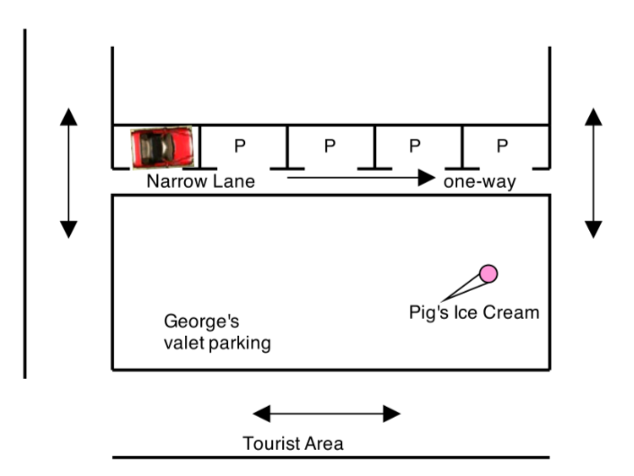
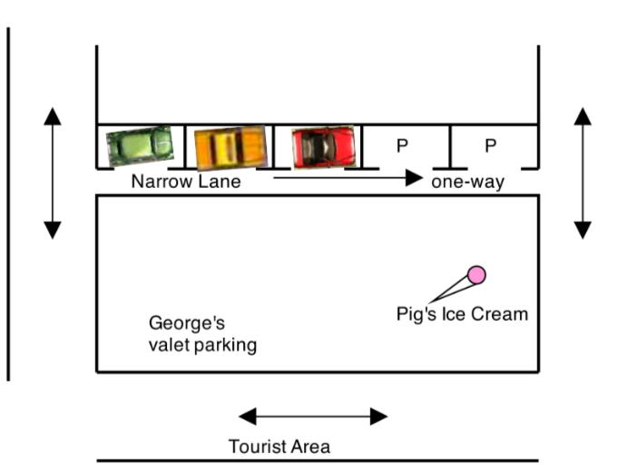
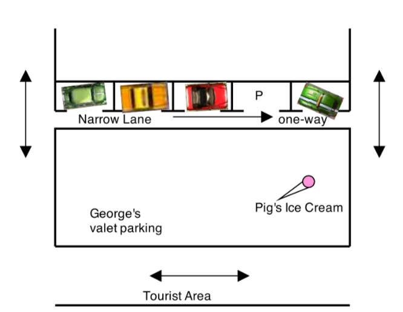

# These Pretzels are Making Me Thirsty

Due: Friday October 11, 2019

Your friend George has come up with a genius money making idea involving parking cars in Charlottetown. George has found a one-way street in Charlottetown that has free parking. This street is one-way so people can only drive in one direction on the street.

The only problem is that the one-way street becomes *impassable* to other cars (since it is so narrow) if anyone parks on the street. George's plan is every morning (when the street is empty) to park in the leftmost position on the street - thus making the street impassable to all other cars (the one way street travels left to right). Now George controls the whole street and all of its valuable free parking. George will offer valet parking for a fee to tourists and make use of the street that he controls (as seen below).



When a tourist asks George to park their car while they attend the local Anne of Green Gables play, George will move his car to the right (forward) by just enough for the next car to fit on the street and then park the customer's car into the leftmost position on the street, George will place a ticket on the dash of the car with a unique positive number on it and then he will give the customer a ticket with that same number. Now there are two cars on the street and George still controls all (legal) access to the street. The customer can use that number to later retrieve their car.

In the sample picture below, George is the red car and he parks two customer cars on the street (in order) Yellow and then Green:



When a customer wants their car back they give their number to George. George then gets in the rightmost (lead) car and drives it off the narrow street. He then asks the question does the number on the ticket on this car's dash match the customer's number? If it is he gives them the car. Otherwise he parks that car back onto the street (as above, each car slides to the right just enough for the former rightmost car to fit back but now into the leftmost spot) and repeats the process until the numbers match.

The street acts exactly like a Queue, first-in, first-out.

Wrinkle:

There is one wrinkle to George's otherwise genius idea (isn't there always), on occasion a local Charlottetown driver will break the traffic rules (gasp!) and they will drive into the rightmost spot on the narrow street (driving the wrong way down a one-way street for short distances is considered legal but only for Charlottetown drivers). Locals call this *nosing* into a spot. 

When a local driver does this, the end of George's street is blocked and so he must back cars off the street, the street mimics a Stack:



When the street is blocked, parking a new car onto the street works the same way (keeping in mind there is now one less available room on the street). Removing a customer car now works like this, George removes the leftmost car on the street (backing it off the one-way street) and asks, does this car's number match the customer's. If it matches he delivers them the car, and then moves all of the other cars to the left by enough to keep the entrance to the street blocked (to maintain control of the street). If it is not the customer's car, George leaves the car temporarily off to the side and then removes the leftmost remaining car in the street and asks the same question. Once George finally finds the customer car he moves all of the remaining cars (on the street) towards the end of the left end of the street (to maintain control) and then parks the temporarily removed cars back on the street - maintaining their original order.

George only operates in Stack mode, when the end of the street is blocked because backing cars off the street is more difficult than driving the correct way.

Note always: A car is only parked on the street if there is enough room on the street to fully accommodate the car. A  car will not be parked on the street if a there is not enough room. George always parks his car so close to the neighbouring car as to leave 0 empty space between the cars. The parking spaces shown in the images are ignored by George, he fits as many cars into the street as possible. 

Your task is to create a program that keeps track of all of the cars on the street. Such that at any time George can print out the exact order of cars on the street including how much free space is left on the street to park more cars. At all times George should maintain control of the street. The above described how George moves the car, your program need only ensure the positions of the objects on the street are correct. You may update links between nodes in any way you like, just ensure the street always ends up in the correct orientation.

For this assignment you **must** create and use your own `doubly linked node` structure, you may use the Linked-List class developed in Chapter 16 to start you off if you wish or the Linked Stack or Linked Queue classes or any of the classes from the book or develop your own. Your class *MUST* implement the StreetParking interface (provided) in a class called `GeorgeLinkedStreet` that has a constructor as follows:

``` java 
public class GeorgeLinkedStreet implements StreetParking{ 
   ...
   /**
    Constructor 
    throws IllegalStateException if Georges car is longer than the length of the street
    @param lengthOfStreet the total length of the street
    @param lengthOfGeorgesCar the length of Georges car
   */
   GeorgeLinkedStreet( int lengthOfStreet, int lengthOfGeorgesCar ) { ... }
   
   ...
}
```
``` java
public Interface StreetParking {

  /**
   attempt to park a car with the given length to the street
   @param length the length of the car being added to the street
   @return -1 if the car cannot be parked on the street (because there is not enough room) 
   or a unique positive number that may be used to retrieve the car otherwise.
  */
  int push (int length); 
  
  /**
    Remove the vehicle with the given ticket number. 
    throws NoSuchElementException if no such car exists
    @param ticketNumber the ticketNumber of the car to remove 
  */
  void remove(int ticketNumber); 
  
  /**
    A local driver attempts to block the end of the street
    @param size the size of the vehicle trying to block the end of the street
    @return true if there is room at the end of the street to block it. False if there 
    is already a vehicle blocking the end of the street or there is not enough room for the vehicle to 
    fit on the street
  */
  boolean block(int size); 
  
  /*
    return true if the street is currently blocked, false otherwise
  */
  boolean isBlocked();
  
  /*
    return the number of cars that George has parked on the street
  */
  int numberOfCars(); 
  
  /*
    return the amount of unoccupied space on the street
  */
  int freeSpace();
  
  /*
    Return the contents of the street in String form by referring to the lengths of the items on the street, 
    whether they are cars George parked, empty spaces, or cars blocking the end of the street. 
    Preface each type of item as follows:
    Cars that George has parked are prefaced with a G, 
    Empty space is prefaced with an E, and 
    any blocking cars are prefaced with a B. 
  */
  String toString() 
  
  /**
     * return an iterator to iterate over the integer spaces occupied (or unoccupied on the street
     * @return the iterator to the leftmost part of the street
     */
    Iterator<Integer> iterator();
}
```

Notice that your class must also implement `Iterator<Integer>` to allow the user to iterate over the spaces of the street whether they are cars or empty spaces. See below example. 

You should provide a driver program with a simple user interface that allows a user to park a car printing back a number, remove a car with a given number and block the end of the street. After any operation the program should print out the contents of the street which are the occupied spaces on the street (similar to the example below).

For example the following code should produce the output given below:

``` java
// a street 100 units long with George's car parked at the leftmost 10 units
GeorgeLinkedStreet street = new GeorgeLinkedStreet(100, 10); 

int camper = street.push(30); //park a camper van
int motorbike = street.push(5);// park a motorbike
boolean itsTrue = street.block(10);//a local driver blocks the end of the street

System.out.println(street); //outputs: `G5 G30 G10 E45 B10`

Iterator it = street.iterator();
while(it.hasNext()) {
  System.out.print(it.next() + " "); //outputs: `5 30 10 45 10`
}
```

output:

`G5 G30 G10 E45 B10`

`5 30 10 45 10`

Which indicates that there are 3 George parked cars of lengths 5, 30 and 10 followed by 45 units of empty space and then a blocking car of lenght 10. (This code is provided in a unittest which you can run).

Ensure your `GeorgeLinkedStreet` class is exactly as shown since the grader will run numerous unittests to ensure your code implements the instructions. Also ensure you throw the exact exceptions mentioned as the grader will look for those. Make sure you've overriden the toString method since this is by default implemented to return the memory location of an Object which isn't what we want.

Grading Scheme:

Gradable | Points
--- | ---
Code Readability | 2pts
Code Design | 3Pts
Functionality | 5Pts

Code Readability: is indentation consistent, are naming conventions followed, are variable names well chosen and all methods commented properly. 

Code Design: is your solution efficient, contains proper classes, no methods over 100 lines, etc

Functionality: does your code pass all of the tests, is your driver program clear and easy to use and allows 

Notice finally that an IntelliJ project is already provided for you in the repository. Open that project and add your code into that project.
